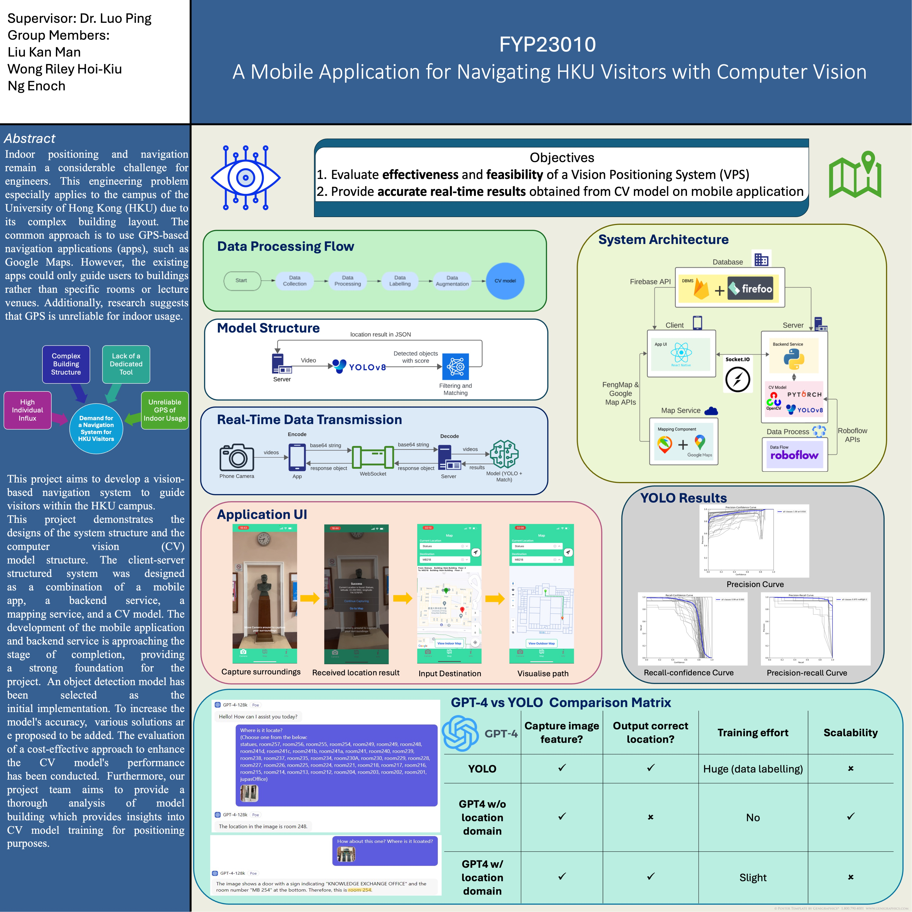

# MapU -- A HKU Navigation Mobile App with Vision Positioning
## -- A Final Year Project of group FYP23010
## The University of Hong Kong, The Department of Computer Science

## Description

MapU, a app that provides indoor positioning and navigation within the campus of the University of Hong Kong. This repo contains the client side (the app) of the project. To investigate how the location detection is done using computer vision, please refer to https://github.com/enoch122/YOLO


## Features

The app provides various features:
1. indoor positioning, allowing users to position themselves within the HKU campus without relying on external devices.
2. indoor map, providing geographical information including both the outdoor and indoor environments.
2. indoor navigation, visualising the optimized path from the source location to the destination.


## Technologies Used

Specify the technologies, frameworks, and libraries used in developing your Expo app. This may include:

- React Native
- WebSocket
- Google Maps


## Installation

To run MapU locally with Expo, follow these steps:

1. Make sure you have Node.js and npm installed on your machine. To install Node.js, you can refer to https://kinsta.com/blog/how-to-install-node-js/ 
2. Install the Expo CLI globally by running the following command:\
   ```npm install expo```
3. Clone this repository to your local machine.
4. Navigate to the project directory in your terminal.
5. Make sure the package.json is in the project directory, and run the following to install the dependencies:\
   ```npm install```


## Usage

To use the app with proper connection to the server, follow these steps:

1. Make sure the location detection server is running, and prepare the IP address of the server.
2. Update the serverURL in the file MapU/src/constant/serverURL.js, for example if the server IP is 10.68.144.171:\
  ```const serverURL = `ws://10.68.144.171:5001`;```
3. Start the Expo development server with the command:\
  ```npx expo start```
5. Download Expo Go on your mobile device.
6. Open the Expo app on your mobile device and scan the QR code displayed in the terminal.
7. The app will be compiled and loaded on your device.


## Configuration

To use Google Maps API, update the file MapU/src/constant/apiKey.js


## Contact

For any enqueries, please contact Melvin Liu via liukanman3167@gmail.com.


## Acknowledgments

Special credit to project supervisor, Dr. Luo Ping.\
Credit to group members, Enoch Ng, Melvin Liu, and Riley Wong.

